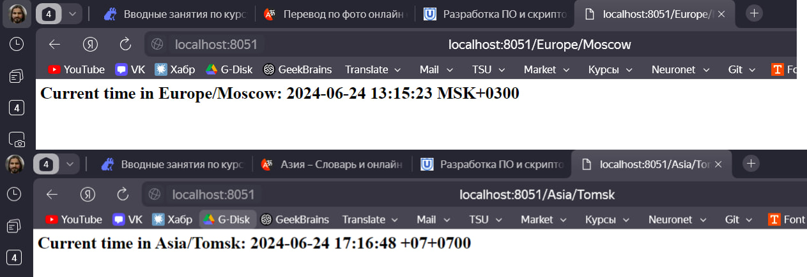
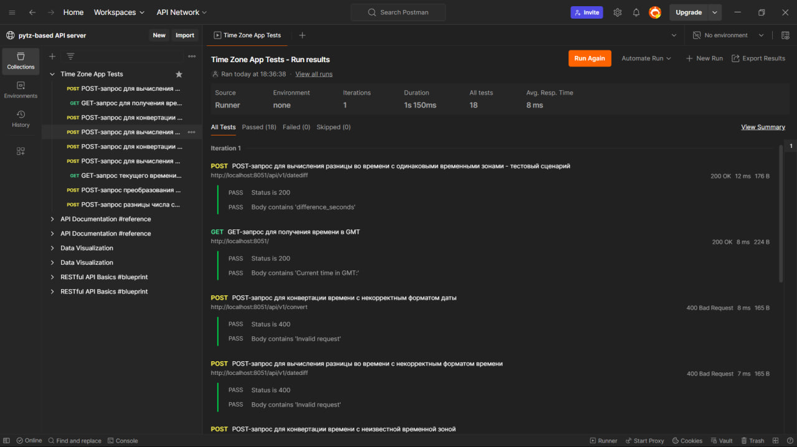

# Сервер API на базе pytz

Это учебное WSGI-приложение, реализующее аналог сервиса time.is и предоставляющее работу с временными зонами на базе библиотеки pytz. 

## Функциональные возможности

* Получить текущее время в заданной временной зоне через GET-запрос. 
* Преобразовать дату/время из одного часового пояса в другой через POST-запрос. 
* Вычислить разницу в секундах между двумя датами из разных часовых поясов через POST-запрос.
.

## Использованные технологии

### Использованные технологии

1. **Python**: Основной язык программирования для разработки приложения.
   
2. **WSGI (Web Server Gateway Interface)**: Интерфейс между веб-серверами и веб-приложениями или фреймворками на Python. Используется для создания WSGI-приложения.
   
3. **pytz**: Библиотека для работы с часовыми поясами. Обеспечивает точное преобразование времени между разными часовыми поясами.
   
4. **wsgiref.simple_server**: Стандартный сервер WSGI, входящий в стандартную библиотеку Python. Используется для запуска WSGI-приложения.

5. **datetime**: Модуль стандартной библиотеки Python для работы с датой и временем. Используется для получения текущего времени и манипуляций с датой и временем.

6. **json**: Модуль стандартной библиотеки Python для работы с JSON-данными. Используется для обработки JSON-запросов и ответов.

7. **unittest**: Библиотека для написания и выполнения тестов в Python. Используется для написания юнит-тестов для приложения.

8. **Postman**: Инструмент для тестирования API. Используется для создания и выполнения запросов к приложению и проверки корректности ответов.

## Тесты работы приложения в Postman:
https://www.postman.com/lunar-module-participant-11808221/workspace/pytz-based-api-server/collection/35083273-72e22f39-1862-496e-81ff-7a458266fdad?action=share&source=copy-link&creator=35083273

## Скриншоты

### Пример выполнения GET-запросов в браузере:



### Результат выполнения тестовых скриптов в Postman:




## Авторы

- Норгей Билинский 
- (https://github.com/NorgeyBilinskiy)

## Структура проекта
```plaintext
pytz-based API server:
│
├── images
│   ├── get_browser.png
│   ├── postman.png
│
├── app.py
├── test_app.py
└── README.md
